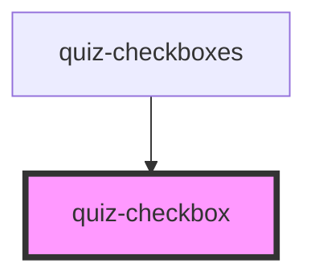

# quiz-checkbox

<!-- Auto Generated Below -->

## Properties

| Property | Attribute | Description   | Type     | Default     |
| -------- | --------- | ------------- | -------- | ----------- |
| `label`  | `label`   | Option answer | `string` | `undefined` |
| `value`  | `value`   |               | `string` | `undefined` |

## Dependencies

### Used by

 - [quiz-checkboxes](../quiz-checkboxes)

### Graph

----------------------------------------------

*Built with [StencilJS](https://stenciljs.com/)*
