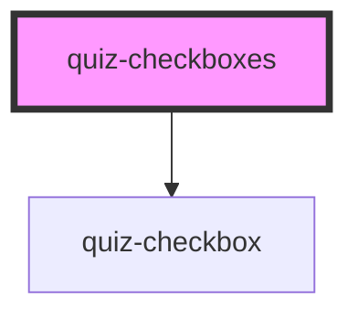

# quiz-checkboxes

<!-- Auto Generated Below -->

## Properties

| Property | Attribute | Description   | Type     | Default     |
| -------- | --------- | ------------- | -------- | ----------- |
| `label`  | `label`   | Option answer | `string` | `undefined` |

## Dependencies

### Depends on

- [quiz-checkbox](../quiz-checkbox)

### Graph

----------------------------------------------

*Built with [StencilJS](https://stenciljs.com/)*
